<div align="center">

# 🎓 Student Performance Predictor

### AI-Powered Academic Performance Analysis & Prediction System

[](https://www.python.org/downloads/)
[](https://flask.palletsprojects.com/)
[](https://scikit-learn.org/)
[](LICENSE)

**Complete Student Performance Card Analysis using AI-powered machine learning models with comprehensive demographic and academic score inputs.**

[Features](#-features) • [Quick Start](#-quick-start) • [How to Use](#-how-to-use) • [Understanding Variables](#-understanding-the-variables) • [Project Structure](#-project-structure)

</div>

---

## ✨ Features

<table>
<tr>
<td width="50%">

### 🤖 AI-Powered Intelligence

- **Multiple ML Models**: Decision Tree, Random Forest, SVM, Neural Network
- **Ensemble Predictions**: Combines all models for superior accuracy
- **AI Insights**: Personalized recommendations via Groq API
- **Model Analysis**: Intelligent performance metrics evaluation

</td>
<td width="50%">

### 🎨 User Experience

- **Animated Interface**: Smooth form animations & transitions
- **Complete Performance Card**: All 8 CSV columns as inputs
- **Real-time Analysis**: Instant predictions with confidence scores
- **Feature Importance**: Visual breakdown of key factors

</td>
</tr>
</table>

---

## 📋 Input Features

### 👥 Demographics & Background

| Feature                | Description                        | Options                            |
| ---------------------- | ---------------------------------- | ---------------------------------- |
| **Gender**             | Student gender                     | Male / Female                      |
| **Race/Ethnicity**     | Anonymized ethnic background       | Groups A-E                         |
| **Parental Education** | Highest education level of parents | Some High School → Master's Degree |
| **Lunch Program**      | Socioeconomic indicator            | Standard / Free-Reduced            |
| **Test Preparation**   | Completion of prep courses         | Completed / None                   |

### 📊 Academic Scores

- **Math Score** (0-100)
- **Reading Score** (0-100)
- **Writing Score** (0-100)
- **Average Score** (auto-calculated)

---

## 🚀 Quick Start

### Prerequisites

```bash
Python 3.8+
pip (Python package manager)
```

### Installation

```bash
# 1. Clone the repository
git clone <your-repo-url>
cd student-performance-predictor

# 2. Install dependencies
pip install -r requirements.txt

# 3. Download dataset
# Get StudentsPerformance.csv from Kaggle:
# https://www.kaggle.com/datasets/spscientist/students-performance-in-exams
# Place it in the project root directory

# 4. Set up environment variables (optional)
cp .env.example .env
# Edit .env with your GROQ_API_KEY for AI insights

# 5. Run the application
python app.py
```

### 🌐 Access the Application

Open your browser and navigate to:

```
http://localhost:5000
```

---

## 🎯 How to Use

```mermaid
graph LR
    A[📝 Fill Student Data] --> B[🔮 Click Predict]
    B --> C[📊 View Model Predictions]
    C --> D[🤖 Read AI Insights]
    D --> E[📈 Analyze Feature Importance]
```

<div align="center">



</div>

1. **Enter Student Information**: Fill in all demographic and academic score fields
2. **Generate Prediction**: Click "Predict Performance" and watch the animation
3. **Review Results**: View predictions from all ML models with confidence scores
4. **AI Insights**: Read personalized recommendations based on score patterns
5. **Analyze Factors**: Examine feature importance and model performance metrics

---

## 📖 Understanding the Variables

### 🔍 What Do These Categories Mean?

<details>
<summary><b>Race/Ethnicity Groups (A-E)</b></summary>

- Anonymized representations of different ethnic backgrounds
- Used to study cultural and social factors affecting academic performance
- Protects student privacy while enabling demographic analysis
- Helps identify patterns in educational outcomes across diverse populations

</details>

<details>
<summary><b>Lunch Program (Socioeconomic Indicator)</b></summary>

**Standard Lunch** 🍽️

- Families pay full meal price
- Indicates higher income households
- Generally above federal poverty guidelines

**Free/Reduced Lunch** 🎟️

- Families qualify for subsidized meals
- Indicates lower income households
- Based on federal poverty guidelines and family income thresholds

**Why It Matters:**

- Commonly used proxy for socioeconomic status in educational research
- Strong correlation with access to educational resources
- Helps identify students who may need additional support

</details>

<details>
<summary><b>Why These Factors Matter</b></summary>

- 📚 **Parental Education**: Correlates with student support and available resources
- 💰 **Socioeconomic Status**: Impacts access to tutoring, materials, and opportunities
- 📝 **Test Preparation**: Shows engagement with structured learning support
- 🎯 **Combined Analysis**: ML models learn complex patterns across all factors

</details>

---

## 📊 Project Structure

```
student-performance-predictor/
│
├── 📄 app.py                      # Main Flask application & ML models
├── 📄 requirements.txt            # Python dependencies
├── 📄 StudentsPerformance.csv     # Dataset (download separately)
├── 📄 .env.example                # Environment variables template
├── 📄 runtime.txt                 # Python version specification
├── 📄 vercel.json                 # Vercel deployment config
│
├── 📁 templates/
│   └── 📄 index.html              # Web interface with animations
│
├── 📄 README.md                   # This file
├── 📄 DEPLOYMENT.md               # Deployment instructions
└── 📄 VERCEL_SETUP.md             # Vercel-specific setup guide
```

---

## 🛠️ Technology Stack

<div align="center">

| Category             | Technologies                                                                                                                                                                                                                                                                                           |
| -------------------- | ------------------------------------------------------------------------------------------------------------------------------------------------------------------------------------------------------------------------------------------------------------------------------------------------------ |
| **Backend**          |                                                                                                                   |
| **Machine Learning** |    |
| **AI Integration**   |                                                                                                                                                                                                                                        |
| **Frontend**         |                 |

</div>

---

## 🤝 Contributing

Contributions are welcome! Feel free to:

- 🐛 Report bugs
- 💡 Suggest new features
- 🔧 Submit pull requests
- 📖 Improve documentation

---

## 📝 License

This project is licensed under the MIT License - see the [LICENSE](LICENSE) file for details.

---

## 🙏 Acknowledgments

- Dataset: [Students Performance in Exams](https://www.kaggle.com/datasets/spscientist/students-performance-in-exams) from Kaggle
- AI Insights powered by [Groq API](https://groq.com/)
- Built with ❤️ using Flask and scikit-learn

---

<div align="center">

**⭐ Star this repository if you find it helpful!**

Made with 🎓 for educational purposes

</div>
